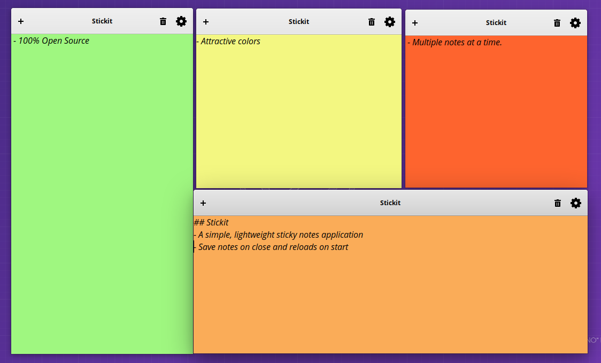

About Stickit
--

A simple, yet powerfull sticky notes application.


If you are curious to test this, please keep in mind that, it is still on the early stages of development. There is a long way to go. Check issues to see what are planned features and how much is achieved.

Installation
--

### Install dependencies

Following packages are required to build **Stickit** in Ubuntu.

- valac
- cmake
- libjson-glib-dev
- libgtk-3-dev
- libgee-0.8-dev

### Building

You may build and install **Stickit** by running `./build.sh` script located in project's root folder. Alternatively, follow the instructions given below.

```
    $ cmake .
    $ make
    $ sudo make install
```

### Running stickit

Stickit can be run from command line using `com.github.niyasc.stickit` command or can be opened from application menu.


